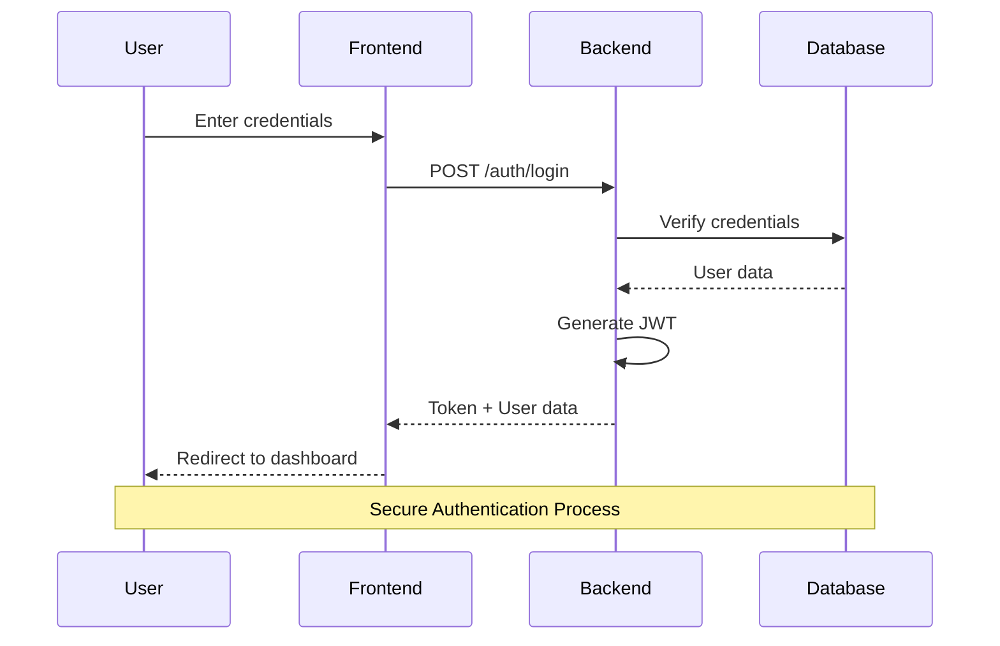
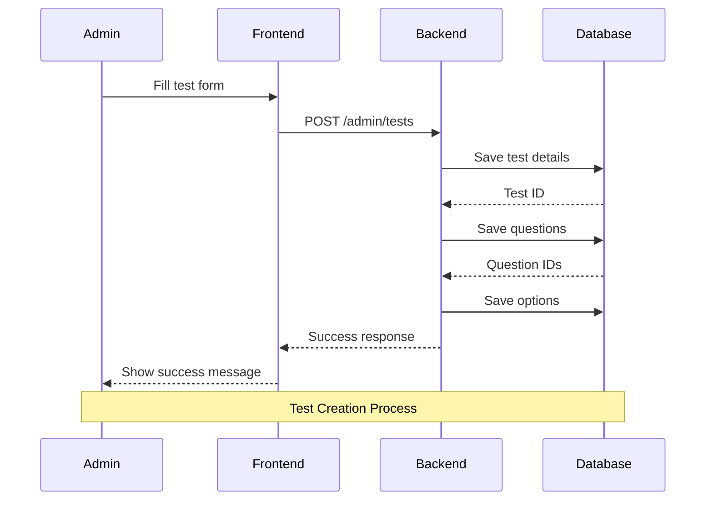
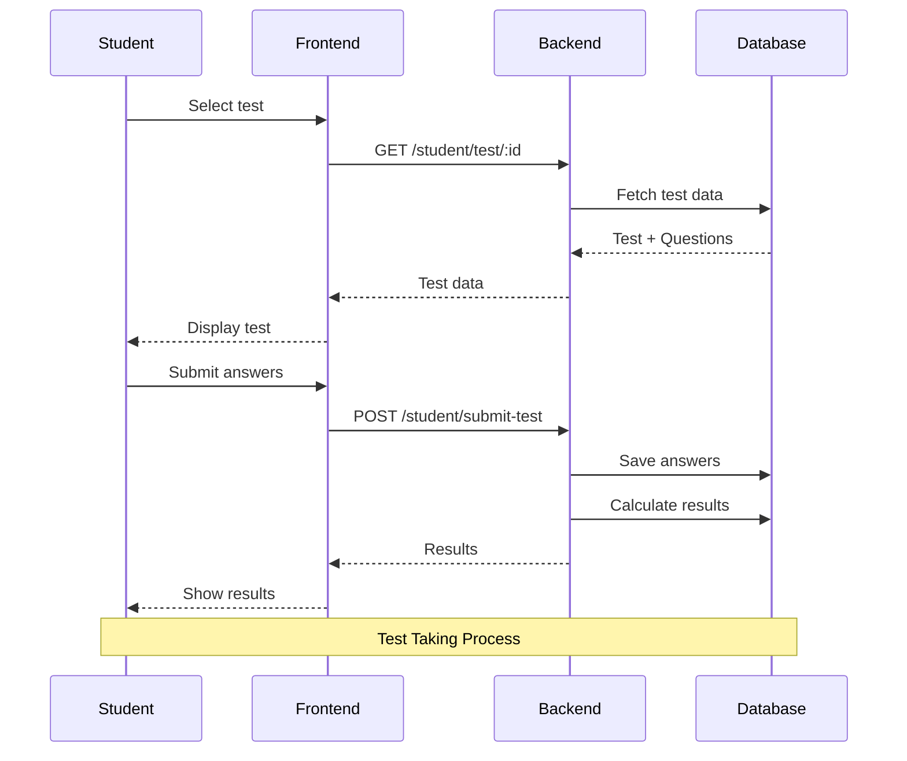

# Online Examination System - Simple Documentation

## What is this project?
This is a web-based system that helps schools and colleges conduct online tests. It has two main types of users:
1. Teachers/Administrators (Admin)
2. Students

## How does it work?

### For Teachers (Admin):
1. **Login/Register**
   - Teachers can create an account
   - Login with email and password
   - Access the admin dashboard

2. **Create Tests**
   - Click "Create New Test"
   - Fill in test details (name, subject, branch, etc.)
   - Add questions with multiple choice options
   - Set time limit and total marks
   - Save the test

3. **Manage Tests**
   - View all created tests
   - Make tests active/inactive
   - Delete tests
   - View student results

### For Students:
1. **Login/Register**
   - Students create an account
   - Login with email and password
   - Access the student dashboard

2. **Take Tests**
   - View available tests
   - Select a test to take
   - Answer questions within time limit
   - Submit answers

3. **View Results**
   - See immediate results after test
   - View correct/incorrect answers
   - Check total score

## Project Structure (Simple Explanation)

### 1. Frontend Files (public folder)
```
public/
├── admin/          # Files for teachers
│   ├── dashboard.html    # Main teacher page
│   ├── tests.html       # Test management page
│   └── view-test.html   # View test details
├── auth/           # Login/Register pages
│   ├── login.html
│   ├── register.html
│   └── admin-register.html
└── student/        # Files for students
    ├── dashboard.html   # Main student page
    ├── tests.html      # Available tests page
    └── test.html       # Test taking page
```

### 2. Backend Files
```
├── routes/         # Handles different web pages
│   ├── admin.js    # Teacher functions
│   ├── auth.js     # Login/Register functions
│   └── student.js  # Student functions
├── database/       # Database setup
│   └── schema.sql  # Database structure
├── config/         # Configuration files
│   └── db.js       # Database connection
└── server.js       # Main server file
```

## How the Code Works (Simple Flow)

1. **When a User Opens the Website:**
   - They see the login page
   - Can choose to login or register

2. **After Login:**
   - Teachers go to admin dashboard
   - Students go to student dashboard

3. **When Creating a Test:**
   - Teacher fills form on tests.html
   - Data goes to server
   - Server saves in database
   - Test appears in test list

4. **When Taking a Test:**
   - Student selects a test
   - Questions load from database
   - Student answers questions
   - Answers are saved
   - Results are shown

## System Architecture Mind Map

```mermaid
graph TD
    %% Main System
    A[Online Exam System] --> B[Frontend]
    A --> C[Backend]
    A --> D[Database]
    
    %% Frontend Components
    B --> B1[Admin Interface]
    B --> B2[Student Interface]
    B --> B3[Auth Interface]
    
    %% Admin Interface Details
    B1 --> B1a[Dashboard]
    B1 --> B1b[Test Management]
    B1 --> B1c[Results View]
    
    %% Student Interface Details
    B2 --> B2a[Dashboard]
    B2 --> B2b[Available Tests]
    B2 --> B2c[Test Taking]
    
    %% Auth Interface Details
    B3 --> B3a[Login]
    B3 --> B3b[Register]
    B3 --> B3c[Admin Register]
    
    %% Backend Components
    C --> C1[Routes]
    C --> C2[Server]
    C --> C3[Config]
    
    %% Routes Details
    C1 --> C1a[Admin Routes]
    C1 --> C1b[Student Routes]
    C1 --> C1c[Auth Routes]
    
    %% Database Components
    D --> D1[Users]
    D --> D2[Tests]
    D --> D3[Questions]
    D --> D4[Options]
    D --> D5[Results]
    
    %% Styling
    classDef default fill:#f9f,stroke:#333,stroke-width:2px;
    classDef frontend fill:#bbf,stroke:#333,stroke-width:2px;
    classDef backend fill:#bfb,stroke:#333,stroke-width:2px;
    classDef database fill:#fbb,stroke:#333,stroke-width:2px;
    
    class B,B1,B2,B3 frontend;
    class C,C1,C2,C3 backend;
    class D,D1,D2,D3,D4,D5 database;
```



## Backend Process Flow

### 1. Authentication Flow


### 2. Test Creation Flow


### 3. Test Taking Flow


## Database Schema Relationships

```mermaid
erDiagram
    Users {
        int id PK
        string email
        string password
        string role
        string branch
        datetime created_at
    }

    Tests {
        int id PK
        int admin_id FK
        string name
        string subject
        int duration
        int total_marks
        string status
        datetime created_at
    }

    Questions {
        int id PK
        int test_id FK
        string question_text
        int marks
        int correct_option
    }

    Options {
        int id PK
        int question_id FK
        string option_text
        int option_number
    }

    Results {
        int id PK
        int user_id FK
        int test_id FK
        int score
        datetime submitted_at
    }

    Users ||--o{ Tests
    Tests ||--o{ Questions
    Questions ||--o{ Options
    Users ||--o{ Results
    Tests ||--o{ Results

```

## Database Structure (Simple Explanation)

1. **Users Table**
   - Stores user information
   - Email, password, role (teacher/student)

2. **Tests Table**
   - Stores test information
   - Name, subject, time limit, etc.

3. **Questions Table**
   - Stores all questions
   - Question text, correct answer

4. **Options Table**
   - Stores answer choices
   - Multiple choice options

5. **Results Table**
   - Stores test results
   - Student scores, answers

## Security Features

1. **Password Protection**
   - Passwords are encrypted
   - Secure login system

2. **User Roles**
   - Teachers can only access teacher pages
   - Students can only access student pages

3. **Data Protection**
   - Secure database connection
   - Protected API endpoints

## How to Run the Project

1. **Setup:**
   - Install Node.js
   - Install MySQL
   - Create database

2. **Installation:**
   ```bash
   npm install
   ```

3. **Database:**
   - Create database named 'online_exam_db'
   - Import schema.sql file

4. **Environment:**
   - Create .env file
   - Add database details
   - Add secret key

5. **Start:**
   ```bash
   npm start
   ```

6. **Access:**
   - Open browser
   - Go to http://localhost:3000

## Common Issues and Solutions

1. **Can't Login:**
   - Check email/password
   - Make sure account exists

2. **Test Not Showing:**
   - Check if test is active
   - Verify student's branch matches

3. **Database Error:**
   - Check database connection
   - Verify database exists

## Support

For any issues or questions:
- Email: rahulparaselli@gmail.com
- GitHub: github.com/rahulparaselli

## Future Improvements

1. **Planned Features:**
   - Image upload for questions
   - PDF export of results
   - Mobile app version

2. **Technical Improvements:**
   - Better error handling
   - More detailed analytics
   - Enhanced security

---

*This documentation is created by Rahul Paraselli for the Online Examination System project.* 
